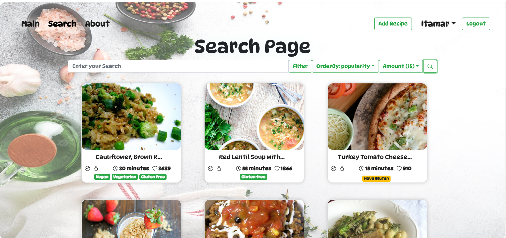

<h1 id="about" class="title">About Our Recipe Platform</h1>

  Welcome to our recipe platform!
   We are dedicated to providing you with a seamless cooking experience and a treasure trove of culinary delights.
   Our platform offers a range of features and functionalities designed to enhance your cooking journey.

<h2>What You Can Do in Our Platform</h2>

  Explore the following features and functionalities available on our platform:

<ul>
  <li>Search Recipes: Easily find recipes tailored to your needs from the extensive collection provided by the spoonacular API.</li>
  <li>Favorite Recipes: Mark and save your favorite recipes for quick access and easy reference.</li>
  <li>Add Recipes: Share your own recipes with the community by easily adding them to our recipe database.</li>
  <li>View Personal Recipes: Organize and view the recipes you have added to your personal collection.</li>
  <li>View Your Family Recipes: Access and enjoy the recipes shared by your family within the platform.</li>
</ul>
<b>Founders:</b>
 <u>Itamar Zafran - ID:</u> 318355872 <u>Mail:</u> Zafran@post.bgu.ac.il
 <u>Nitay Yakoby   - ID:</u> 206102519 <u>Mail:</u> Yakoby@post.bgu.ac.il

 <b>Last Projects GitHub:</b>

# Instrucntions:
## Server Side
Setup
Navigate to the server-side directory:

### Copy code
cd server-side
Install the necessary dependencies:
npm install
Configuration
Create a .env file in the server-side directory and add the following configuration for Spoonacular API:

### env file
Copy code
SPOONACULAR_API_KEY=YOUR_SPOONACULAR_API_KEY_HERE
Replace YOUR_SPOONACULAR_API_KEY_HERE with your actual Spoonacular API key.

## Client Side
Setup
Navigate to the client-side directory:

### Copy code
cd client-side
Install the necessary dependencies:

### Copy code
npm install
Running the Project
Start the server:

### Copy code
cd server-side
npm start
Start the client:

### Copy code
cd client-side
npm start
Access the application in your web browser at http://localhost:3000/.

## Screen Shots
# Main Page
  

# Search Page
  

# My Recipe Page
  

# My Favorite Page
  

# Recipe Page
  

# Contributing
Feel free to contribute to this project by creating issues or submitting pull requests. We welcome your contributions!